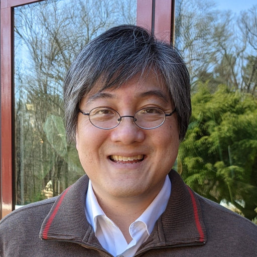
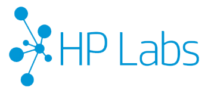
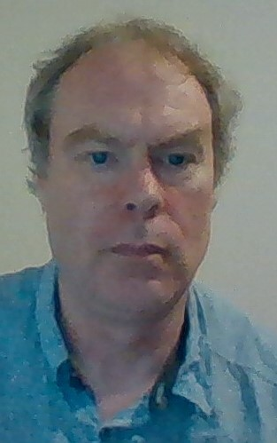
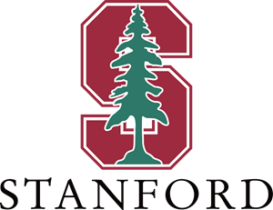
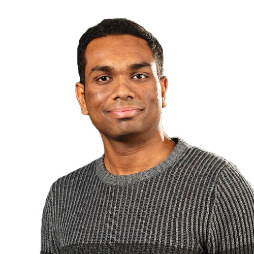
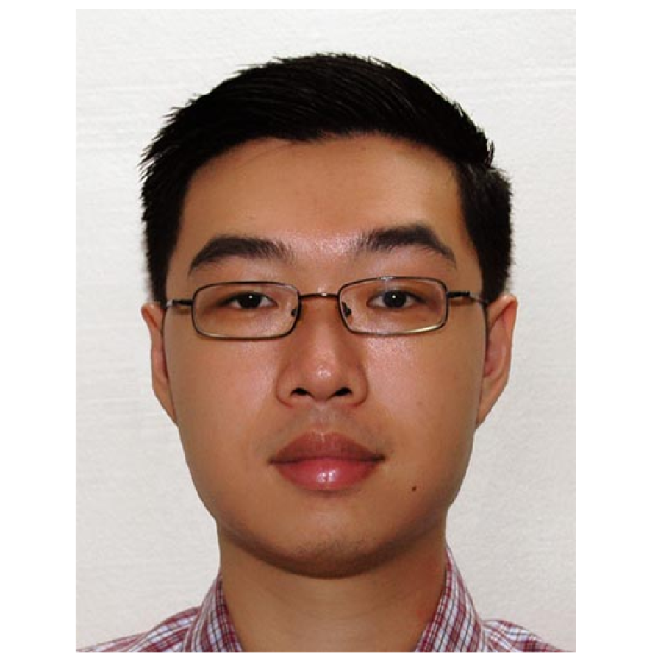
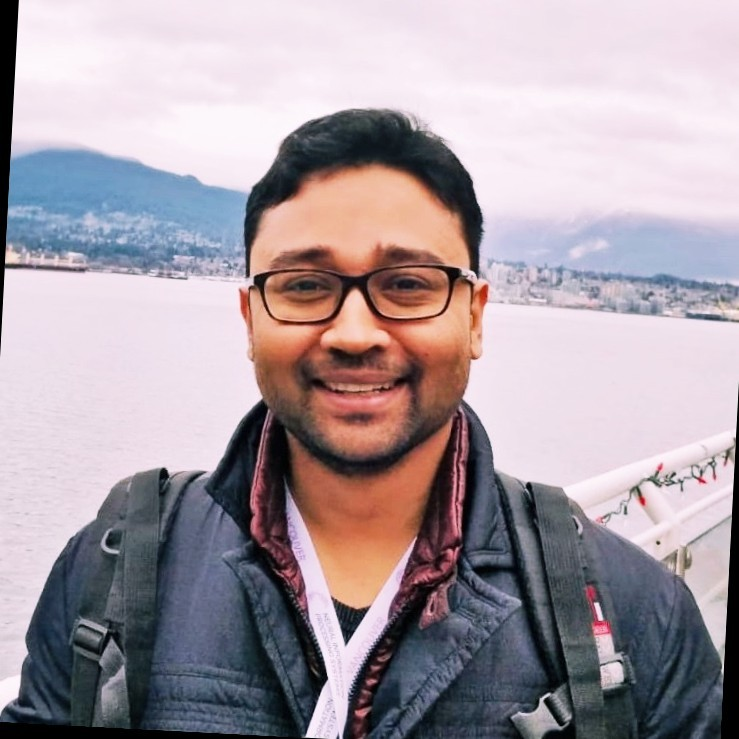
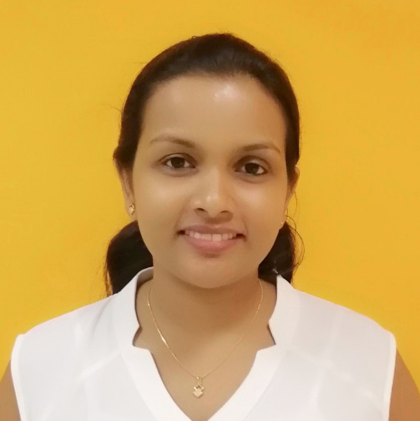
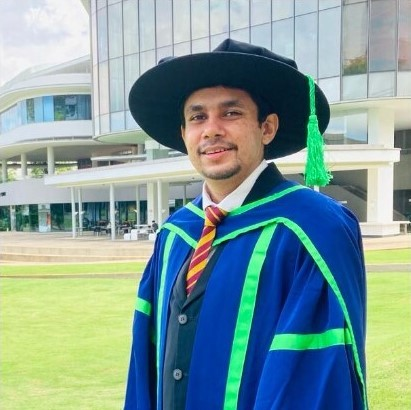
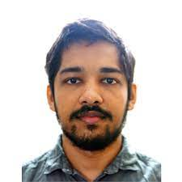

.
# Overview
Despite the remarkable performance and many applications, Machine Learning systems may have many pitfalls. For example, Deep Neural Networks (DNNs) can be fooled into malfunction by simply applying a small perturbation to the data, indicating that these techniques are not robust. Further, incidents have been reported where the ML decisions were unfair and hurt people in the minority or historically disadvantaged groups. Troubleshooting such issues with some of the best performing ML systems (e.g., DNNs) is also not possible due to their black-box nature. In other words, they are not human interpretable. Furthermore, unlike standard software systems, the validity of operations of an ML system cannot be formally verified against a user specification. To address these issues, the ML community has extensively researched techniques to make ML systems trustworthy because when deployed in the real world, human lives may depend on these systems. The umbrella covering interpretability, robustness, fairness, and verifiability of ML systems is commonly referred to as trustworthy ML. 

This workshop aims to raise awareness of possible pitfalls of existing ML algorithms among many practitioners and users and emphasize the importance of developing trustworthy ML algorithms. To achieve this objective, the workshop will bring together international experts from ML interpretability, fairness, robustness, and verifiability to discuss the progress so far, issues, challenges, and the path forward.

**The workshop will be held virtually on 29th July 2022.**  <a href="https://docs.google.com/forms/d/1s61akOeFWVrJdtu0NTNhY6NmFRNmxfBsxd5OKyJ3I7s/viewform?edit_requested=true" target="_blank"> **REGISTRATION IS FREE** </a> 

# Invited Speakers

 
## <a href="https://baulab.info/" target="_blank">David Bau</a> 
 **Assistance Professor, Northeastern University, USA.** 

<table>
  <tr>
   <td width="30%"></td>
    <td>David Bau is currently a postdoctoral fellow at Harvard University, and he will assume duty as an Assistant Professor at Northeastern University, the USA starting in fall 2022. David is a leading researcher in interpretable DNN methods whose Ph.D. dissertation is titled dissection of Deep Networks. His work attempts to understand the rich internal structure of DNNs. He has contributed to pioneer research in the interpretability community and published in many premier peer-reviewed conferences. Before starting his Ph.D., he worked for tech giants like Google and Microsoft.</td>
  </tr>
</table>

## <a href="https://www.linkedin.com/in/adrian-baldwin-2a97065" target="_blank">Adrian Baldwin</a>
**Senior Researcher, HP Labs, United Kingdom** 

<table>
  <tr>
   <td width="30%"></td>
    <td>  Adrian Baldwin is a senior researcher in the Security Lab within HP Labs, UK. Over the years, he has worked on and published in a range of security areas, including security analytics and using ML for security, modeling systems to understand security trade-offs, automating audits, and securing audit logs. He has a Ph.D. in neural networks and natural language understanding from Exeter University.</td>
  </tr>
</table>

## <a href="https://www.ransalu.com/" target="_blank">Ransalu Senanayake</a>
**Postdoctoral Researcher, Stanford University, USA**

<table>
  <tr>
    <td width="30%"></td>
    <td>Ransalu Senanayake is a postdoctoral research scholar in the Machine Learning Group at the Department of Computer Science, Stanford University. Working at the intersection of modeling and decision-making, he focuses on making autonomous systems equipped with ML algorithms trustworthy. Prior to joining Stanford, Ransalu obtained a Ph.D. in Computer Science from the University of Sydney in 2019. He has been an Associate Editor for the IEEE International Conference on Intelligent Robots and Systems (IROS) since 2021.</td>
  </tr>
</table>

 
## <a href="https://www.linkedin.com/in/gilbertlim/" target="_blank">Gilbert Lim</a>
**AI Scientist, SingHealth, Singapore**

<table>
  <tr>
    <td width="30%"></td>
    <td>  Gilbert is currently an AI Scientist with SingHealth and holds research appointments at the SingHealth Duke-NUS Ophthalmology & Visual Sciences Academic Clinical Programme and Singapore Eye Research Institute. His past research involved the application of machine learning to healthcare, most prominently in ophthalmology, and has been published in journals such as JAMA, The Lancet Digital Health, and npj Digital Medicine. He obtained his doctorate in computer science from the National University of Singapore in 2016.</td>
  </tr>
</table>

 
## <a href="https://www.linkedin.com/in/jayjaynandy/?originalSubdomain=in" target="_blank">Jay Nandy</a>
**Postdoctoral Researcher, Google India, India**

<table>
  <tr>
    <td width="30%"></td>
    <td>  Jay Nandy is currently working as a visiting researcher at Google Research, India. He completed his Ph.D. from the School of Computing, the National University of Singapore, in 2021. Before joining Google, he also worked as a research assistant at NUS. His research interests include robustness for Deep Learning models, predictive uncertainty estimation, unsupervised and weakly supervised learning, etc. He has published in premier AI conferences.
</td>
  </tr>
</table>

# Workshop Schedule
All times are in the Indian Standard Time zone (GMT +5:30 hours). \
*Topics of the invited talkes might be changed by the speaker*

| Time         | Session | Speaker/s |
| ------------------ | ----------------- | ------------------------ |
||||
| 4.15 - 4.20 pm | Welcome (Opening) | Sanka Rasnayaka |
| 4.20 - 5.00 pm| Machine Learning Risk Management Frameworks | Adrian Baldwin |
| 5.00 - 5.40 pm | Trustworthy ML for Healthcare | Gilbert Lim |
| 5.40 - 6.00 pm | Explainable AI for Smart City Applications |  Sandareka Wickramanayake |
| 6.00 - 6.10 pm | Break | - |
| 6.10 - 6.50 pm | Robustness and Uncertainty Estimation for Deep Neural Networks | Jay Nandy |
| 6.50 - 7.30 pm | Interpretable Machine Learning |  David Bau |
| 7.30 - 8.10 pm | Safety and Robustness of Autonomous systems | Ransalu Senanayake |
| 8.10 - 8.20 pm | Break | - |
| 8.20 - 9.20 pm | Panel Discussion | Moderator - Dileepa Fernando |
| 9.20 - 9.30pm | Closing Remarks (Closing) | Dileepa Fernando |

# Register

**Limited seats available**: Register here:  <a href="https://docs.google.com/forms/d/1s61akOeFWVrJdtu0NTNhY6NmFRNmxfBsxd5OKyJ3I7s/viewform?edit_requested=true" target="_blank">REGISTRATION LINK</a>

# Organizers

<table>
   <tr>
    <td align="center"> </td>
    <td align="center">  </td>
    <td align="center">  </td>
  </tr>
  <tr>
    <td>  <a href="http://sandareka.github.io/" target="_blank">Sandareka Wickramanayake</a>   </td>
    <td>  <a href="https://www.linkedin.com/in/fernandodileepa/" target="_blank">Dileepa Fernando</a> </td>
    <td>  <a href="https://comp.nus.edu.sg/~sanka" target="_blank">Sanka Rasnayaka</a> </td>
  </tr>
   <tr>
   <td> University of Moratuwa </td>
   <td> Nanyang Technological University </td>
  <td> National University of Singapore </td>
  </tr>
</table>

# Program Committee

Ashraf Abdul - National University of Singapore

